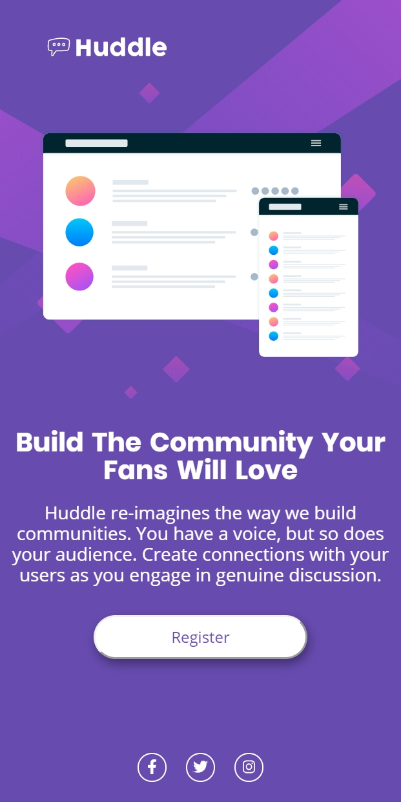
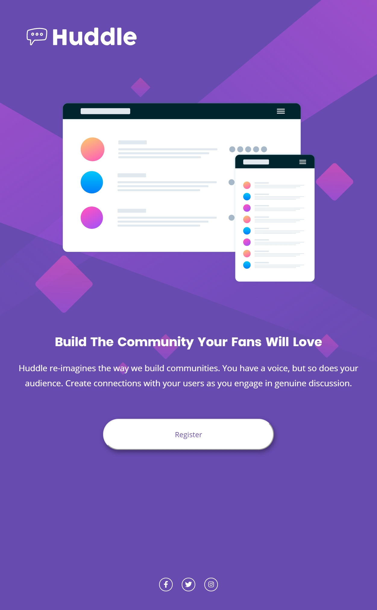
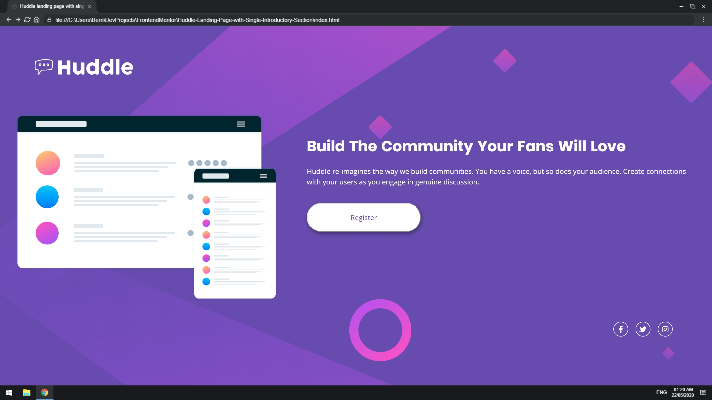

## Huddle Landing Page with Single Introductory Section

## Welcome! 👋

Thanks for checking out this project.

This project was build on purely HTML and CSS.

## Introduction

Huddle is a single landing page meant for practicing layout and responsive design skills in CSS.

This project was obtained from a list of challenges by Frontend Mentor.

## Objectives of the project

* Use as much semantic HTML5 markup. *Think accessibility, readability and SEO optimization.*

* Style with reusable CSS classes. 

* Use responsive design to make the page compatible on screen across mobile and desktop devices.

* Keep the code as clean as possible.

And most importantly, _**Happy coding!🚀**_

## Technical Components

* Flexbox

* Media queries used to build the responsive design.

## Attribution

[UI social media icons by Font Awesome](https://fontawesome.com/ "Font Awesome")

[Responsive design testing app by Sizzy](https://a.paddle.com/v2/click/49831/114619?link=1947/ "Sizzy.co")

## Screenshots of Responsive Design

#### Phone (iPhone 11 @ 414 x 896)

#### Tablet (iPad Pro 11 @ 834 x 1194)

#### Desktop with browser UI (Any device resolution @ 1920 x 1080)

